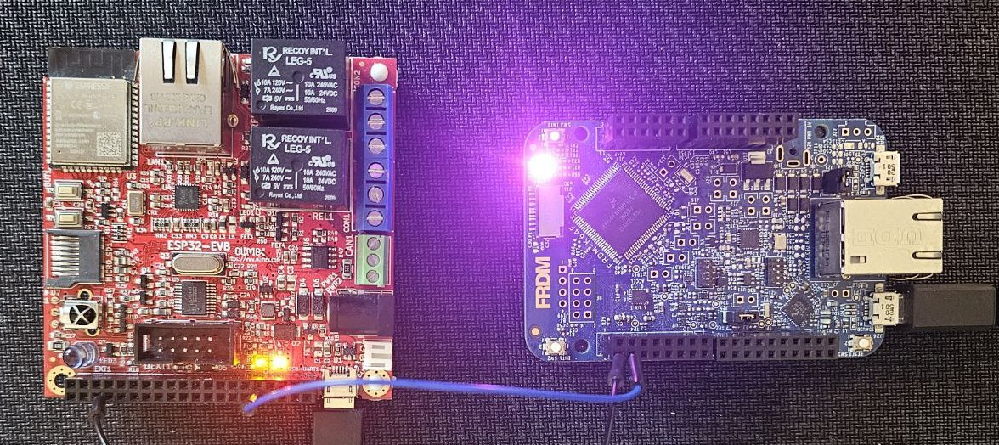

# ESP32 & FRDM-K64F Real-Time Clock Synchronization via UART

This project demonstrates how to synchronize the **RTC (Real-Time Clock)** of an NXP **FRDM-K64F** development board using date and time received from an **ESP32**, which fetches the current time from an **NTP server** over Wi-Fi.

## 📌 Overview

- The **ESP32** connects to an NTP server to get the accurate date and time.
- It then sends the date and time over **UART** to the **FRDM-K64F** board.
- The **FRDM-K64F** has a **menu system** with two options:
  - `S) Synchronize`: Receive date and time via UART and set RTC.
  - `D) Display`: Print the current date and time from the internal RTC to the terminal.

---

## 🔧 Hardware Connections

| ESP32      | FRDM-K64F |
|------------|-----------|
| GND        | GND       |
| UART1 TX   | PTC16     |
| UART1 RX   | PTC17     |

> Ensure both devices share a common ground.

---

## 💻 Software Stack

- **ESP32**: Programmed using [PlatformIO](https://platformio.org/) with the Arduino framework.
- **FRDM-K64F**: Programmed using [MCUXpresso IDE](https://www.nxp.com/mcuxpresso/ide) with the Kinetis SDK.

---
 

